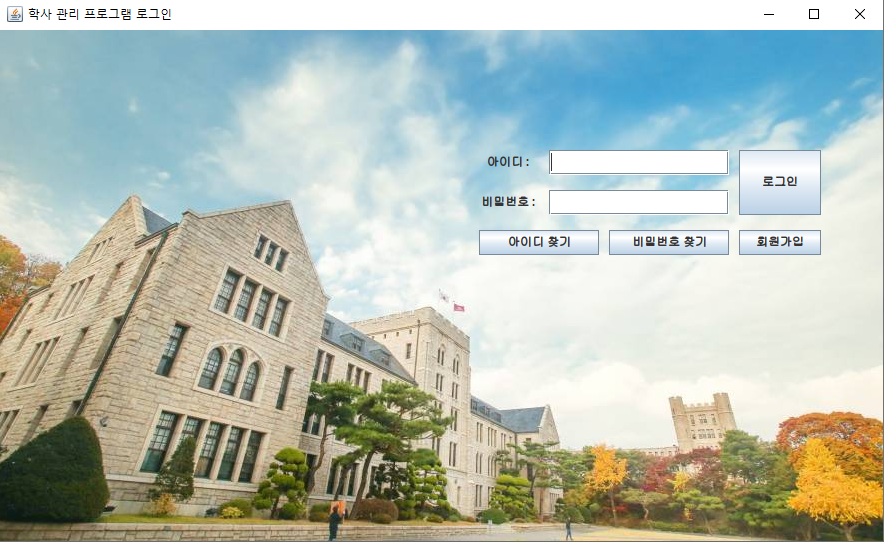
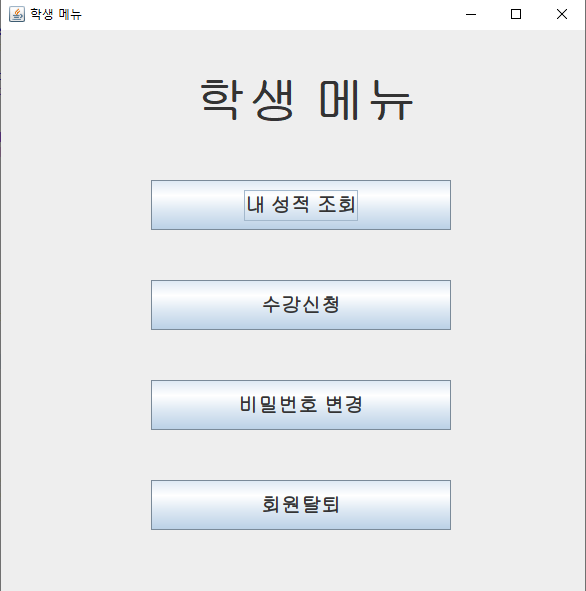
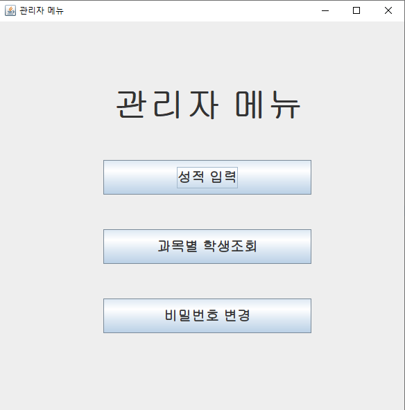
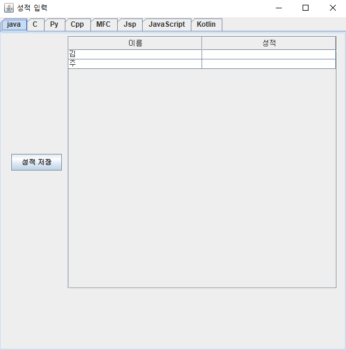

# java-StudyManage Application

- 교육센터에서 이루어진 7일 프로젝트입니다.

## 로그인 화면



- ID/PW 입력 후 로그인
- 학생 아이디이면 학생메뉴 / 관리자 아이디이면 관리자 메뉴
- 아이디찾기 / 비밀번호 찾기/ 회원가입
- 데이터는 .csv 형식의 파일입출력을 하였습니다.

## 학생메뉴



## 관리자메뉴



- 성적 입력 / 성적 조회 / 비밀번호 변경

## 성적입력



```java
ArrayList<Student> stu  = dio.getStudentdata();


public class Student {
	String name;
	String pw;
	String id;
	ArrayList<AlJoSubject> sub = new ArrayList<AlJoSubject>(); ...


  public class AlJoSubject  {	
	String subject;
	int score; ...

```

- 모든 팀원이 같은 변수를 사용하기 위해 Student 클래스를 자료형으로하는 ArrayList 사용
- Student 클래스 안에 AlJoSubject 클래스를 자료형으로 하는 ArrayList 존재
- 과목명은 AljoSubject안에 String형의 변수로 존재
- 관리자 입장에서 성적 입력 시 과목별로 수강하는 학생을 조회함
- 문제는 변수의 형식이 학생을 기준으로 선언되어 있어서 A라는 학생이 java라는 과목을 수강하는지 확인하기 위해서는 Student.sub.subject.. 이런 식으로 참조해서 해야함.
- 데이터의 형태를 관리자가 사용하는 형식과 학생이 사용하는 형식 2가지로 나눠서했으면 조금 더 수월하지 않았을까 생각합니다.
- 팀 프로젝트이기에 주어진 변수에 맞춰서 데이터를 사용한 것 같습니다.
- 결론 : 좋은 경험이였습니다.